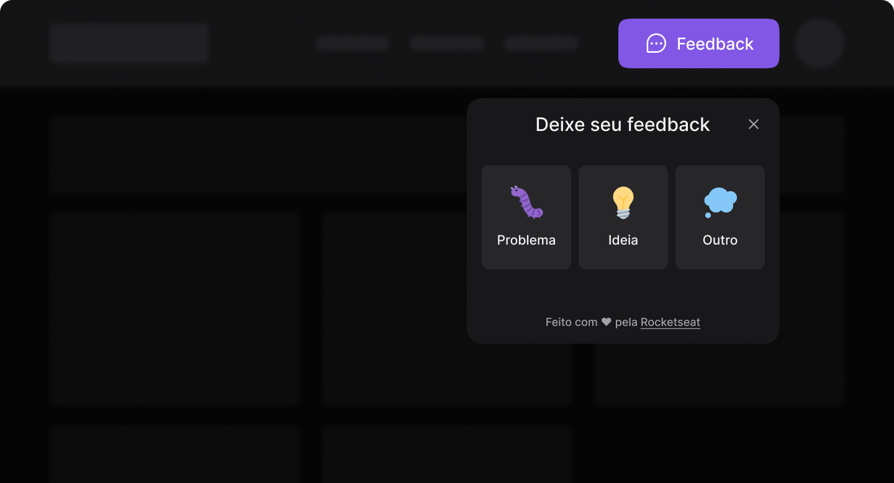

<h1 align="center">
  FedGet
</h1>

<p align="center">
  
  
  
  
  

  <a href="https://github.com/leovargasdev/nlw-return-web/commits/master">
    
  </a>
  
  <a href="https://github.com/leovargasdev/nlw-return-web/issues">
    
  </a>
</p>

<p align="center">
  
</p>

## 💻 Projeto

Esse projeto foi desenvolvido durante o **Evento NLW Return** em _livecoding_ na [Twitch.tv](https://www.twitch.tv/leovargasdev).
O protótipo desse website foi desenvolvido pelo [**Ilana Mallak**](https://www.instagram.com/ilanamallak/), [clique aqui](https://www.figma.com/file/4OgcQfKrfG6zjASK6pKg1a?node-id=10%3A1637) para abrir o protótipo no figma.

Dependências usadas no projeto:

-  [React]()
-  [Tailwind])
-  [Headlessui]()
-  [TypeScript](https://www.typescriptlang.org/)

## 📥 Instalação e execução

Faça um clone desse repositório e acesse o diretório.

```bash
# Instalando as dependências
$ npm install 

# Executanto aplicação
$ npm run dev
```
